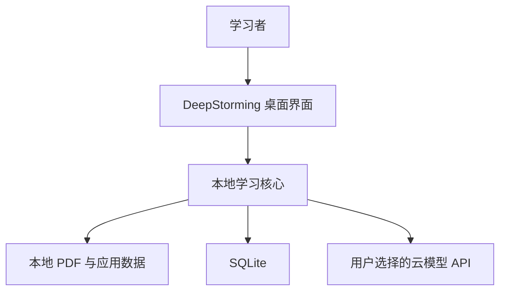
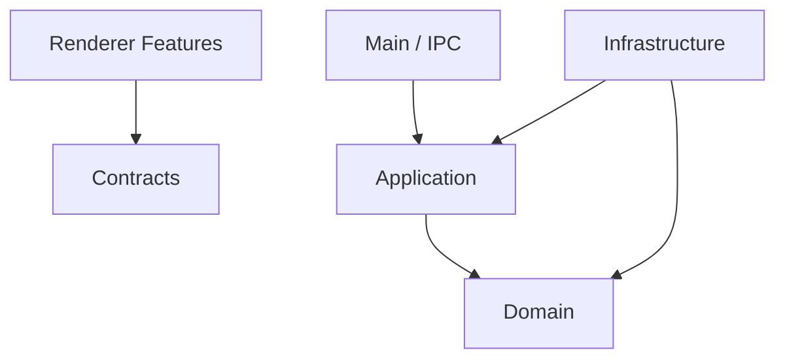

# DeepStorming 技术架构说明书

- 文档版本：v0.1
- 对应产品规格：`product_spec.md` v0.1
- 架构风格：模块化单体 + Ports and Adapters
- 桌面运行时：Electron
- 主要语言：TypeScript

## 1. 架构目标

DeepStorming 的架构首先服务于稳定性、可测试性和后续扩展，而不是追求框架数量或形式上的复杂性。

核心目标：

1. 从空仓库建立可验证的工程边界，避免旧版逻辑迁移。
2. 让教材与论文共享文档基础设施，但保留独立学习工作流。
3. 将教学决策从 React 组件和超长 Prompt 中抽离为可测试的状态机。
4. 将文件、数据库、模型和密钥等外部能力封装为适配器。
5. 让所有长任务可观察、可取消、可重试、可恢复。
6. 在 macOS 首发的同时，避免业务代码依赖 macOS 专有 API。

## 2. 架构决策摘要

### ADR-001：Electron 而非 Tauri

选择 Electron + React + TypeScript，优先获得成熟跨平台生态、统一 Chromium 行为和全 TypeScript 开发体验。接受安装包和内存占用较高的代价。

### ADR-002：模块化单体而非微服务

MVP 是本地单用户桌面应用。微服务会引入部署、通信和一致性复杂度，暂不适用。模块边界通过工作区包、接口和依赖规则保证。

### ADR-003：通用 LearningDocument

底层不使用仅面向教材的 `Book` 作为根实体。教材和论文都是 `LearningDocument` 的业务扩展。

### ADR-004：显式课堂状态机

模型负责生成候选教学内容和评价，应用负责决定当前状态、允许的动作、幂等写入和何时完成课堂。

### ADR-005：SQLite 本地持久化

所有核心学习数据采用 SQLite。全文索引属于可重建派生数据，API Key 不以明文保存在数据库中。

### ADR-006：BYOK 直接调用

模型请求由 Electron Main Process 发出。Renderer 不接触完整 Key，也不直接调用外部模型 API。

### ADR-007：先词法检索，再混合检索

MVP 先使用章节范围、FTS5/BM25、邻接扩展和来源校验建立可测试基线。Embedding 通过接口后加，不阻塞第一条学习闭环。

## 3. 系统上下文



边界说明：

- PDF、索引、课堂记录和复习数据默认留在本机。
- 云模型只接收当前任务所需的检索片段、课堂上下文和结构化指令。
- 首版没有 DeepStorming 业务服务器、账号服务器或统一模型代理。

## 4. Electron 进程模型

### 4.1 Renderer Process

职责：

- React UI、路由、页面状态和可访问性。
- PDF 页面显示、引用高亮和课堂交互。
- 通过受控 IPC 调用应用用例。

禁止：

- 直接访问 Node.js、文件系统、SQLite、Keychain 或 Provider SDK。
- 持有完整 API Key。
- 在组件中编写 SQL、文件路径逻辑或 Provider 特有请求。

### 4.2 Preload Process

职责：

- 使用 `contextBridge` 暴露最小、明确、版本化的 API。
- 对 IPC 参数做第一层运行时校验。
- 不包含业务规则，不缓存敏感数据。

示意：

```ts
window.deepstorming.documents.importPdf(input)
window.deepstorming.providers.testConnection(input)
window.deepstorming.lessons.sendTurn(input)
window.deepstorming.jobs.subscribe(jobId, listener)
```

### 4.3 Main Process

职责：

- 应用启动、窗口生命周期和单实例控制。
- 组合 Application Use Cases 与 Infrastructure Adapters。
- IPC Handler、Provider 调用、文件授权、数据库事务和密钥访问。
- 启动和管理后台任务。

限制：

- 不执行耗时 PDF 解析或大规模文本处理。
- 不在 IPC Handler 中直接实现业务规则。
- 所有 Handler 仅做校验、调用用例和错误映射。

### 4.4 Utility Process / Worker

职责：

- PDF 文本与布局提取。
- 文档清洗、分块和索引预处理。
- 后续 OCR、Embedding 或计算密集型任务。

Worker 只接收任务输入和临时路径，返回结构化结果与进度事件。Worker 崩溃不得导致 Main Process 或 UI 崩溃。

## 5. 代码目录

```text
deepstorming/
├── apps/
│   └── desktop/
│       ├── src/
│       │   ├── main/
│       │   │   ├── bootstrap/
│       │   │   ├── ipc/
│       │   │   ├── windows/
│       │   │   ├── jobs/
│       │   │   └── security/
│       │   ├── preload/
│       │   └── renderer/
│       │       ├── app/
│       │       ├── features/
│       │       └── shared/
│       └── electron-builder.yml
├── packages/
│   ├── domain/
│   ├── application/
│   ├── contracts/
│   ├── infrastructure/
│   └── testkit/
├── migrations/
├── tests/
├── docs/
└── pnpm-workspace.yaml
```

## 6. 依赖方向



强制规则：

1. `domain` 不依赖其他业务包，也不依赖 Electron、React、SQLite 或网络 SDK。
2. `application` 依赖 `domain`，并声明外部能力 Ports。
3. `infrastructure` 实现 Ports，可依赖第三方库。
4. `contracts` 保存跨进程 DTO、Schema、错误码和事件定义，不保存业务实现。
5. Renderer 只使用 Contracts 和 UI ViewModel，不直接使用数据库实体。
6. Main 是 Composition Root，负责实例化依赖，不成为“万能服务类”。

构建阶段应使用 ESLint 边界规则或依赖图测试阻止反向导入。

## 7. 领域模块

### 7.1 Documents

负责：

- 文档身份、类型、生命周期和导入状态。
- 页、布局块、资产、章节大纲和来源锚点。
- 文档删除和派生数据重建规则。

不负责：课堂教学、模型调用和 React 阅读器。

### 7.2 Curriculum

负责教材章节、学习目标、概念、前置关系和概念来源。

### 7.3 Pedagogy

负责课堂状态、允许的状态转换、提示阶梯、问题支线和完成条件。

### 7.4 Assessment

负责费曼评价量表、掌握证据、误区和掌握状态更新规则。

### 7.5 Papers

负责论文研究问题、贡献、方法、观点、实验、证据、局限和研究启发，不负责通用 PDF 解析。

### 7.6 Review

负责复习项目、复习事件和调度接口。具体调度算法是可替换策略。

### 7.7 Companions

负责伙伴身份、表达风格和叙事记忆。不得写入掌握度或更改教材证据。

## 8. Application Ports

```ts
interface DocumentStoragePort {
  copyIntoLibrary(sourcePath: string): Promise<StoredDocument>
  removeStoredDocument(storageKey: string): Promise<void>
}

interface DocumentParserPort {
  inspect(input: ParseInput): Promise<DocumentInspection>
  parse(input: ParseInput, progress: ProgressSink): Promise<ParsedDocument>
}

interface SearchIndexPort {
  rebuild(documentId: string): Promise<void>
  search(query: SearchQuery): Promise<SearchHit[]>
}

interface TutorModelPort {
  streamTutorAction(input: TutorInput): AsyncIterable<TutorEvent>
  evaluateTeachBack(input: AssessmentInput): Promise<TeachBackAssessment>
  getCapabilities(): ModelCapabilities
}

interface SecretVaultPort {
  put(secret: string): Promise<string>
  get(secretRef: string): Promise<string>
  remove(secretRef: string): Promise<void>
}

interface ReviewSchedulerPort {
  schedule(input: ReviewScheduleInput): ReviewSchedule
}
```

Ports 的输入输出使用领域值对象或 Application DTO，不暴露第三方 SDK 类型。

## 9. IPC 合约

### 9.1 统一结果

```ts
type AppResult<T> =
  | { ok: true; data: T; requestId: string }
  | {
      ok: false
      error: {
        code: AppErrorCode
        message: string
        retryable: boolean
        details?: Record<string, unknown>
      }
      requestId: string
    }
```

错误码示例：

```text
PROVIDER_AUTH_FAILED
PROVIDER_RATE_LIMITED
PROVIDER_MODEL_NOT_FOUND
DOCUMENT_PERMISSION_DENIED
DOCUMENT_PASSWORD_PROTECTED
DOCUMENT_NO_TEXT_LAYER
DOCUMENT_PARSE_FAILED
DATABASE_MIGRATION_FAILED
LESSON_STATE_CONFLICT
STRUCTURED_OUTPUT_INVALID
```

### 9.2 IPC 规则

- Channel 名称集中注册，禁止页面自定义字符串。
- 请求和响应均使用 Zod Schema 校验。
- 每个写操作携带 `requestId` 或 `idempotencyKey`。
- IPC 不返回 Error 实例、文件句柄、数据库连接或敏感 Provider 对象。
- 事件订阅必须返回取消订阅函数，窗口销毁时自动清理。

## 10. 文档导入架构

状态机：

```text
SELECTED
→ COPYING
→ VALIDATING
→ EXTRACTING
→ STRUCTURING
→ CHUNKING
→ INDEXING
→ READY
```

终止状态：`FAILED`、`CANCELLED`。

流程：

1. Main 通过原生文件选择器获得用户授权路径。
2. 立即在数据库创建 `document_import_jobs`。
3. 文件复制到应用数据目录，计算哈希并检查重复。
4. Worker 使用 PDF.js 提取页、文本块、坐标和基础元数据。
5. Application 规范化标题、页眉页脚和阅读顺序。
6. 生成块、Chunk、章节大纲和可定位资产。
7. 在事务中批量写入，再构建 FTS 索引。
8. 成功后将文档置为 `READY`；失败保留阶段、错误码和可重试信息。

幂等规则：

- 同一 Job 的已完成阶段不得重复创建相同记录。
- Chunk 使用文档、版本、页范围和内容哈希形成稳定去重键。
- FTS 是派生索引，可以删除后重建。
- 删除半成品导入时必须只清理该文档的资源。

## 11. 检索增强架构

MVP 检索流水线：

```text
课堂目标或用户问题
→ 确定文档与章节范围
→ 查询规范化
→ FTS5/BM25 检索
→ 标题与定义加权
→ 相邻 Chunk 扩展
→ 去重与上下文预算控制
→ 来源锚点校验
→ 传给模型
```

检索输出：

```ts
type RetrievedEvidence = {
  chunkId: string
  text: string
  score: number
  reason: string
  anchor: SourceAnchor
}
```

后续混合检索通过新增 `EmbeddingPort` 和融合排序器实现，不改变课堂用例。

## 12. 课堂运行时

### 12.1 职责划分

应用负责：

- 当前课堂状态和允许的下一步。
- 选择学习目标、检索范围和 Prompt 版本。
- 保存用户消息、模型事件、引用和状态转换。
- 校验模型结构化输出。
- 处理暂停、重试、取消和恢复。

模型负责：

- 在给定状态和证据内生成提问、提示、短讲解或评价候选。
- 输出结构化教学动作和引用声明。
- 不直接决定数据库写入或任意跳转状态。

### 12.2 TutorAction

```ts
type TutorAction = {
  actionType: 'question' | 'hint' | 'explanation' | 'assessment' | 'reflection'
  state: LessonState
  utterance: string
  primaryQuestion?: string
  citedChunkIds: string[]
  learnerDiagnosis?: {
    correctParts: string[]
    gaps: string[]
    misconceptions: string[]
  }
  proposedNextState: LessonState
}
```

`proposedNextState` 只是建议，必须由 Domain 状态机验证。

### 12.3 流式输出

- 模型文本可以流式显示，但数据库只在一轮完成并校验后提交最终消息。
- 中途取消保留可显示草稿，但不把未完成输出计入掌握证据。
- 结构化元数据通过最终事件提交，不能从半截文本猜测。

## 13. Prompt 与模型治理

Prompt 分为：

- 基础安全与证据规则。
- 教学策略 Prompt。
- 文档类型工作流 Prompt。
- 伙伴风格 Prompt。
- 当前课堂状态 Prompt。

组装顺序固定，伙伴风格处于最低业务优先级。每次模型调用保存：

- Provider、模型和能力。
- Prompt 模板版本及哈希。
- 检索 Chunk ID。
- 结构化输出校验结果。
- 延迟、Token 或可获得的用量信息。
- 关联的课堂步骤或导入任务。

生产日志不得默认保存完整 API Key、Authorization Header 或未经处理的敏感请求体。

## 14. 数据与事务边界

主要事务：

1. 导入阶段批量写入页、块、Chunk 和资产。
2. 完成一轮课堂：用户消息、AI 消息、引用、状态转换和 Model Run 关联。
3. 完成课堂：总结、掌握证据、误区和复习项目。
4. 删除文档：验证引用关系后删除或阻止删除。

SQLite 必须启用：

```sql
PRAGMA foreign_keys = ON;
PRAGMA journal_mode = WAL;
PRAGMA busy_timeout = 5000;
```

具体 SQLite Binding 在工程骨架阶段通过打包 Spike 确认。候选实现必须通过 macOS 开发构建、签名打包和原生模块重建测试后锁定。

## 15. 安全架构

### 15.1 Electron 安全基线

- `nodeIntegration: false`
- `contextIsolation: true`
- Renderer Sandbox 开启。
- 仅加载本地打包资源，不执行远程页面代码。
- Preload 仅暴露细粒度函数，不暴露通用 `invoke`。
- 设置 CSP，禁止任意脚本和非白名单网络连接。
- 外部 URL 通过系统浏览器打开并校验协议。

### 15.2 密钥

- 使用 Electron `safeStorage` 或操作系统 Keychain 能力加密。
- 数据库只保存 `secret_ref` 或密文记录引用，不保存明文。
- 编辑 Provider 时，空 Key 表示保持原值，显式操作才替换或删除。
- Renderer 只得到 `hasApiKey: boolean`。

### 15.3 文件

- 用户选择 PDF 后复制到应用管理目录，后续不依赖原始路径持续授权。
- 所有内部路径通过 Storage Key 表示，不直接暴露给 Renderer。
- 文件名不能直接拼接为应用目录路径。

## 16. 可观测性

日志采用结构化事件：

```text
app.started
provider.connection_tested
document.import_stage_changed
document.import_failed
lesson.state_transitioned
lesson.turn_failed
model.request_completed
database.migration_completed
```

每个事件包含时间、请求 ID、Job/Session ID、错误码和必要元数据。默认日志不包含整段教材、完整对话和敏感请求。

应用提供“诊断信息导出”，允许用户主动导出脱敏日志、版本、迁移版本和任务状态。

## 17. 测试架构

### 17.1 单元测试

- 课堂状态转换。
- 提示阶梯和追问上限。
- 费曼评价聚合与掌握证据更新。
- 文档导入状态机。
- 复习调度接口。
- 错误映射和 Schema 校验。

### 17.2 合约测试

- IPC 请求/响应兼容性。
- Provider Adapter 结构化输出。
- DocumentParser 输出 Schema。
- 数据库 Repository 行为。

### 17.3 集成测试

- 数据库迁移与事务回滚。
- PDF 解析、分块、索引和检索。
- 安全密钥保存、更新和删除。
- 导入任务在重启后的恢复。

### 17.4 端到端测试

- 首次启动到 Provider 配置。
- 导入 PDF 到 `READY`。
- 引用跳转。
- 完整教材课堂。
- 暂停、重启和恢复。
- 完成复习。

## 18. 架构风险与控制

| 风险                       | 控制措施                                             |
| -------------------------- | ---------------------------------------------------- |
| Electron 包体与内存较大    | 接受首版代价；延迟加载重型页面和 Worker              |
| SQLite 原生模块打包失败    | Phase 1 先做签名打包 Spike，再锁定 Binding           |
| PDF 双栏、公式和图表解析差 | 保存原页与坐标；建立测试语料；允许视觉/OCR 回退      |
| LLM 输出不稳定             | 结构化 Schema、重试策略、Prompt 版本和 Mock 合约测试 |
| 苏格拉底追问造成挫败       | 追问上限、提示阶梯、微讲解和用户可切换节奏           |
| 伙伴内容干扰事实           | Prompt 分层、最低优先级、独立记忆和可关闭            |
| 长期数据无法迁移           | 迁移测试、备份、禁止运行时随意改表                   |

## 19. 演进路径

1. MVP：文本型 PDF 教材、词法检索、单 Provider 课堂、复习。
2. Paper：论文结构、方法与实验审查、图表证据。
3. Retrieval：Embedding、重排序和多文档比较。
4. Local AI：Ollama 或其他本地模型 Adapter。
5. Cross-platform：Windows 打包、系统密钥和路径适配。
6. Optional Cloud：仅在产品确认需要账号、同步或统一计费时增加服务端。

任何演进均通过新 Adapter 或工作流扩展，不能绕过现有 Domain 和 Application 边界。
