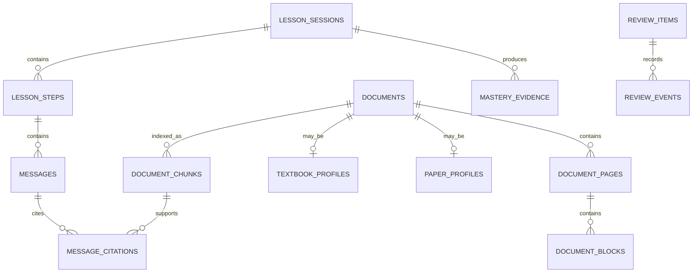

# DeepStorming 数据库设计说明书

- 文档版本：v0.1
- 数据库：SQLite
- 对应架构：`architecture.md` v0.1
- 说明：本文定义逻辑 Schema、约束与迁移策略；实际 DDL 按开发阶段拆分为顺序迁移文件。

## 1. 设计原则

1. 使用通用 `documents` 表承载教材和论文身份，不建立以 `books` 为中心的底层。
2. 原始事实、用户学习事件和可重建派生数据分离。
3. API Key 永不以明文写入数据库。
4. 掌握度是多条证据的聚合结果，不能覆盖或删除历史证据。
5. 模型生成的课程结构、论文观点和评价必须保留来源与生成版本。
6. 所有跨表关系启用外键，删除行为显式定义。
7. 所有时间保存为 UTC ISO 8601 字符串；显示时再转换为本地时区。
8. 主键统一使用应用生成的 `TEXT` ID；实现阶段优先采用可排序 UUID。
9. 全文索引和 Embedding 属于派生数据，应能从页、块和 Chunk 重建。
10. 表结构只能通过 Migration 变更。

## 2. SQLite 基线

每个连接初始化：

```sql
PRAGMA foreign_keys = ON;
PRAGMA journal_mode = WAL;
PRAGMA synchronous = NORMAL;
PRAGMA busy_timeout = 5000;
```

建议通用字段：

```text
id          TEXT PRIMARY KEY
created_at  TEXT NOT NULL
updated_at  TEXT NOT NULL
```

只有确实需要恢复或审计的聚合根使用 `deleted_at`；内部派生行优先硬删除并通过外键级联。

## 3. 关系总览



## 4. 系统与设置

### 4.1 `schema_migrations`

| 字段       | 类型    | 约束     | 说明         |
| ---------- | ------- | -------- | ------------ |
| version    | INTEGER | PK       | 单调递增版本 |
| name       | TEXT    | NOT NULL | 迁移名       |
| checksum   | TEXT    | NOT NULL | 文件校验值   |
| applied_at | TEXT    | NOT NULL | 执行时间     |

约束：已执行迁移不得静默修改；Checksum 不一致时启动失败并给出诊断。

### 4.2 `app_settings`

| 字段       | 类型 | 约束     | 说明     |
| ---------- | ---- | -------- | -------- |
| key        | TEXT | PK       | 设置键   |
| value_json | TEXT | NOT NULL | JSON 值  |
| updated_at | TEXT | NOT NULL | 更新时间 |

不得存放 API Key、Token 或完整敏感请求。

### 4.3 `ai_providers`

| 字段              | 类型    | 约束               | 说明                                  |
| ----------------- | ------- | ------------------ | ------------------------------------- |
| id                | TEXT    | PK                 | Provider ID                           |
| provider_type     | TEXT    | NOT NULL           | `mock/deepseek/openai_compatible/...` |
| display_name      | TEXT    | NOT NULL           | 用户可见名称                          |
| base_url          | TEXT    | NULL               | 自定义接口地址                        |
| model_name        | TEXT    | NOT NULL           | 模型名称                              |
| secret_ref        | TEXT    | NULL               | 安全存储引用，不是明文 Key            |
| capabilities_json | TEXT    | NOT NULL           | 流式、结构化、视觉等能力              |
| is_active         | INTEGER | NOT NULL DEFAULT 0 | 是否当前使用                          |
| last_test_status  | TEXT    | NULL               | 最近连接测试结果                      |
| last_tested_at    | TEXT    | NULL               | 最近测试时间                          |
| created_at        | TEXT    | NOT NULL           | 创建时间                              |
| updated_at        | TEXT    | NOT NULL           | 更新时间                              |
| revision          | INTEGER | NOT NULL DEFAULT 1 | 内部单调版本；不进入公共 Provider DTO |

索引与约束：

- `provider_type` 检查约束。
- 任意时刻最多一个 `is_active = 1`，通过部分唯一索引实现。
- 删除 Provider 前检查是否仍被运行中的课堂引用。
- `revision >= 1`；创建时为 `1`。更新和启用事务比较期望 revision，成功时原子递增。

### 4.4 `provider_write_requests`

| 字段                   | 类型 | 约束     | 说明                                                                              |
| ---------------------- | ---- | -------- | --------------------------------------------------------------------------------- |
| request_id             | TEXT | PK       | IPC request ID；完成结果不可变                                                    |
| operation              | TEXT | NOT NULL | `create/update/delete/activate`                                                   |
| target_provider_id     | TEXT | NOT NULL | 目标 Provider ID；与 operation 共同绑定重放身份                                   |
| outcome_status         | TEXT | NOT NULL | `succeeded/removed/blocked/not_found`                                             |
| provider_snapshot_json | TEXT | NULL     | Provider 或删除结果快照；含内部 `revision`，可含 `secret_ref`，不得含原始 API Key |
| created_at             | TEXT | NOT NULL | 结果与业务写入在同一事务中提交                                                    |

约束：同一 `request_id` 的重放仅在 `operation` 和非空 `target_provider_id` 都匹配时返回原始逻辑结果且不再次应用业务写入；否则拒绝。快照可因 blocked/not-found 等结果为空，但目标身份不得依赖快照。Provider 创建、更新、启用和原子删除必须与对应结果行在同一事务内提交。更新和启用使用调用方首次读取的内部 `revision` 作为事务内乐观并发条件，成功时递增；`updated_at` 仅用于展示和审计。启用还必须在事务内验证目标仍为 Mock 或具有 `secret_ref`。

连接测试状态不进入本表。Repository 使用独立 `provider_test_operations` 表按 `operation_id` 持久化同一次状态转换，并以期望状态执行比较并交换，只允许将 `testing` 转换为终态；转换结果为 `applied/replayed/stale/not_found`。该持久化结构在 Task 6 建立，Task 8 在其上实现连接测试编排与取消。

### 4.5 `provider_test_operations`

| 字段                   | 类型 | 约束     | 说明                                     |
| ---------------------- | ---- | -------- | ---------------------------------------- |
| operation_id           | TEXT | PK       | 单次连接测试操作 ID                      |
| provider_id            | TEXT | NOT NULL | Provider 逻辑引用                        |
| current_status         | TEXT | NOT NULL | `testing/success/error/cancelled`        |
| provider_snapshot_json | TEXT | NOT NULL | 该次成功转换产生的严格校验 Provider 快照 |
| created_at             | TEXT | NOT NULL | 首次进入 `testing` 的时间                |
| updated_at             | TEXT | NOT NULL | 最近一次成功状态转换时间                 |

`operation_id` 与 `provider_id` 绑定。首次转换只能进入 `testing`；终态转换必须比较当前 `testing` 状态，并与 Provider 状态、结果快照及 revision 增量在同一事务提交。操作历史不随 Provider 删除而删除；重复相同状态返回持久化的原始快照且不增加 revision，即使 Provider 后续已被编辑或删除。

## 5. 文档与导入

### 5.0 已实现的最小文本文档库（Migration 2）

当前仓库在 Migration 2 (`document_text_import`) 里已经落地的是 Phase 3 最小切片，而不是本节后续更完整的 PDF/结构化导入蓝图。已实现表如下。

### 5.0.1 `learning_documents`

| 字段               | 类型 | 约束     | 说明                             |
| ------------------ | ---- | -------- | -------------------------------- |
| id                 | TEXT | PK       | 文档 ID                          |
| document_type      | TEXT | NOT NULL | `generic/textbook/paper`         |
| title              | TEXT | NOT NULL | 文档标题                         |
| source_kind        | TEXT | NOT NULL | `pasted_text/text_file`          |
| original_file_name | TEXT | NULL     | 导入文件名；粘贴文本时为空       |
| content_hash       | TEXT | NOT NULL | 规范化正文 SHA-256，用于重复检测 |
| created_at         | TEXT | NOT NULL | 创建时间                         |
| updated_at         | TEXT | NOT NULL | 最近更新时间                     |

索引与约束：

- `UNIQUE(content_hash)`：当前最小切片按正文内容去重。
- `document_type`、`source_kind` 通过 `CHECK` 约束限制枚举值。

### 5.0.2 `document_text_versions`

| 字段            | 类型    | 约束                                          | 说明                 |
| --------------- | ------- | --------------------------------------------- | -------------------- |
| id              | TEXT    | PK                                            | 文本版本 ID          |
| document_id     | TEXT    | FK `learning_documents(id)` ON DELETE CASCADE | 所属文档             |
| plain_text      | TEXT    | NOT NULL                                      | 当前存储的规范化正文 |
| character_count | INTEGER | NOT NULL, `CHECK (character_count >= 0)`      | 字符数               |
| created_at      | TEXT    | NOT NULL                                      | 该文本版本创建时间   |

当前 Phase 3 最小切片每个文档只写入首个文本版本，未来若支持编辑历史或多版本导入，可在该表上继续扩展。

### 5.0.3 `lesson_sessions`（Migration 3）

当前仓库在 Migration 3 (`lesson_session_foundation`) 里落地的是 Phase 5 课堂最小会话骨架，用于在接入真实 AI 课堂前先保存本地会话与来源引用。

| 字段           | 类型 | 约束                                          | 说明                         |
| -------------- | ---- | --------------------------------------------- | ---------------------------- |
| id             | TEXT | PK                                            | 课堂会话 ID                  |
| title          | TEXT | NOT NULL                                      | 用户可见课堂标题             |
| status         | TEXT | NOT NULL                                      | `active/archived`            |
| document_id    | TEXT | FK `learning_documents(id)` ON DELETE CASCADE | 来源文档                     |
| document_title | TEXT | NOT NULL                                      | 创建会话时的文档标题         |
| current_state  | TEXT | NOT NULL                                      | 状态机当前状态；Migration 12 |
| created_at     | TEXT | NOT NULL                                      | 创建时间                     |
| updated_at     | TEXT | NOT NULL                                      | 最近更新时间                 |

### 5.0.4 `lesson_source_anchors`（Migration 3）

| 字段         | 类型    | 约束                                          | 说明                         |
| ------------ | ------- | --------------------------------------------- | ---------------------------- |
| id           | TEXT    | PK                                            | 来源锚点 ID                  |
| lesson_id    | TEXT    | FK `lesson_sessions(id)` ON DELETE CASCADE    | 所属课堂会话                 |
| document_id  | TEXT    | FK `learning_documents(id)` ON DELETE CASCADE | 来源文档                     |
| start_offset | INTEGER | NOT NULL, `CHECK (start_offset >= 0)`         | 当前文本版本中的起始字符位置 |
| end_offset   | INTEGER | NOT NULL, `CHECK (end_offset > start_offset)` | 当前文本版本中的结束字符位置 |
| snippet      | TEXT    | NOT NULL                                      | 创建会话时使用的来源片段     |

当前课堂来源锚点仍保留文本 offset 与 snippet 作为稳定审计字段；PDF 页码与 block 已在后续 D3 写入 `lesson_source_anchors`，chunk 检索证据已在后续 D4 写入 `lesson_model_runs.input_summary_json`。精确 bounding box 高亮仍属于后续扩展。

### 5.0.5 `lesson_messages`（Migration 4）

当前仓库在 Migration 4 (`lesson_message_foundation`) 里落地课堂消息基础。该表先服务于本地 Mock Tutor 首轮提问，后续可扩展为真实 Provider 运行记录与多轮课堂消息。

| 字段                   | 类型    | 约束                                       | 说明                                  |
| ---------------------- | ------- | ------------------------------------------ | ------------------------------------- |
| id                     | TEXT    | PK                                         | 消息 ID                               |
| lesson_id              | TEXT    | FK `lesson_sessions(id)` ON DELETE CASCADE | 所属课堂会话                          |
| role                   | TEXT    | NOT NULL                                   | `system/tutor/learner`                |
| content                | TEXT    | NOT NULL                                   | 消息正文；当前首问只引用选中 snippet  |
| source_anchor_ids_json | TEXT    | NOT NULL                                   | JSON 字符串数组，指向本消息引用的锚点 |
| prompt_version         | TEXT    | NOT NULL                                   | 生成该消息的 Prompt 版本占位          |
| message_index          | INTEGER | NOT NULL, `CHECK (message_index >= 0)`     | 会话内消息顺序                        |
| created_at             | TEXT    | NOT NULL                                   | 消息创建时间                          |
| model_run_id           | TEXT    | NULL                                       | 生成该消息的模型运行记录；Migration 5 |

索引与约束：

- `role` 通过 `CHECK` 约束限制为 `system/tutor/learner`。
- `UNIQUE(lesson_id,message_index)` 保证同一课堂内消息顺序不重复。
- `model_run_id` 由 Migration 5 追加，可为空以兼容已创建的本地课堂消息。
- 当前不保存 Provider 请求、token、原始 prompt 或错误详情；Model Run 只保存脱敏摘要。

### 5.0.6 `lesson_model_runs`（Migration 5）

Migration 5 (`lesson_model_run_foundation`) 为本地 Mock Tutor 首轮提问增加生成记录，并为后续真实 Provider 调用预留审计骨架。

| 字段                   | 类型 | 约束                                           | 说明                                                 |
| ---------------------- | ---- | ---------------------------------------------- | ---------------------------------------------------- |
| id                     | TEXT | PK                                             | Model Run ID                                         |
| lesson_id              | TEXT | FK `lesson_sessions(id)` ON DELETE CASCADE     | 所属课堂会话                                         |
| provider_id            | TEXT | FK `ai_providers(id)` ON DELETE SET NULL, NULL | 真实 Provider ID；本地 Mock 为空                     |
| model_name             | TEXT | NOT NULL                                       | 模型快照；当前为 `mock-local`                        |
| operation              | TEXT | NOT NULL                                       | `lesson_tutor_first_question/lesson_tutor_follow_up` |
| status                 | TEXT | NOT NULL                                       | `started/succeeded/failed/cancelled`                 |
| prompt_manifest_json   | TEXT | NOT NULL                                       | Prompt key、version 和 hash                          |
| input_summary_json     | TEXT | NOT NULL                                       | 脱敏输入摘要，不含完整正文                           |
| source_anchor_ids_json | TEXT | NOT NULL                                       | JSON 字符串数组，指向证据锚点                        |
| output_message_id      | TEXT | NULL                                           | 生成的消息 ID                                        |
| started_at             | TEXT | NOT NULL                                       | 运行开始时间                                         |
| finished_at            | TEXT | NULL                                           | 运行结束时间                                         |
| error_summary_json     | TEXT | NULL                                           | 失败/取消时的安全错误摘要；Migration 7               |

当前 `input_summary_json` 只保存 `documentId`、`documentTitle`、`sourceAnchorIds`、字符范围、snippet 字符数，以及 follow-up 场景下的 learner reply 字符数；不保存完整文档正文、完整学习者回答以外的派生 prompt、API Key、Authorization header、原始 prompt 或原始响应。`error_summary_json` 只保存稳定 `{ code, message, retryable }`，用于课堂页展示可恢复原因；不得写入 Provider 原始响应、请求体、密钥、Authorization header 或堆栈。

运行恢复语义：应用层允许对 `failed/cancelled` 的课堂生成记录发起重试。重试不会覆盖原 run 的 `status`、`output_message_id` 或时间戳，而是追加新的 `lesson_tutor_follow_up` run 和对应 tutor message，从而保留失败历史与新结果的审计链路。`started/succeeded` run 不可重试。

### 5.0.7 `lesson_model_runs` operation 扩展（Migration 6）

Migration 6 (`lesson_follow_up_operation`) 重建 `lesson_model_runs` 表的 `operation` 检查约束，使本地多轮课堂可以记录 `lesson_tutor_follow_up`。该迁移保留已有 run 行，只扩大允许的 operation 枚举，不改变已保存数据。

### 5.0.8 `lesson_model_runs` 安全错误摘要（Migration 7）

Migration 7 (`lesson_model_run_error_summary`) 为 `lesson_model_runs` 追加 `error_summary_json` 可空字段。新增字段服务于 Provider/generator 失败后的课堂恢复：失败 run 可以在重启后继续显示稳定错误原因并保留重试入口；历史 run 和成功 run 保持 `NULL`。

字段内容由应用层从稳定 `LessonUseCaseError` 派生，当前形态为：

```json
{
  "code": "INTERNAL_ERROR",
  "message": "The lesson operation could not be completed.",
  "retryable": true
}
```

该字段是用户安全摘要，不是诊断日志；排查真实 Provider 问题时应通过后续专门的脱敏日志/遥测设计扩展，而不是把原始错误写入本表。

### 5.0.12 LessonState 状态机（Migration 12）

Migration 12 (`lesson_state_machine`) 为课堂会话增加可恢复、可解释的状态机审计链路。它在 `lesson_sessions` 上追加 `current_state`，并新增 `lesson_steps` 表。历史会话通过 `current_state = 'opening'` 默认值兼容；Renderer 对缺少 step 的历史 run 显示“状态机记录尚未生成”。

`lesson_sessions.current_state` 的允许值：

- `opening`
- `probing`
- `hinting`
- `explaining`
- `reflecting`
- `summarizing`
- `completed`
- `paused`
- `error`

#### `lesson_steps`

| 字段               | 类型    | 约束                                              | 说明                                  |
| ------------------ | ------- | ------------------------------------------------- | ------------------------------------- |
| id                 | TEXT    | PK                                                | Step ID；当前与对应 model run ID 对齐 |
| lesson_id          | TEXT    | FK `lesson_sessions(id)` ON DELETE CASCADE        | 所属课堂会话                          |
| sequence_no        | INTEGER | NOT NULL, `CHECK (sequence_no >= 0)`              | 课堂内 step 顺序                      |
| state_before       | TEXT    | NOT NULL                                          | 执行动作前状态                        |
| state_after        | TEXT    | NOT NULL                                          | 执行动作后状态                        |
| action_type        | TEXT    | NOT NULL                                          | `ask/hint/explain/reflect/summarize`  |
| status             | TEXT    | NOT NULL                                          | `started/succeeded/failed/cancelled`  |
| model_run_id       | TEXT    | FK `lesson_model_runs(id)` ON DELETE CASCADE      | 对应生成运行记录                      |
| message_id         | TEXT    | FK `lesson_messages(id)` ON DELETE SET NULL, NULL | 成功生成的 tutor message              |
| rationale          | TEXT    | NULL                                              | 成功 step 的简短安全说明              |
| error_summary_json | TEXT    | NULL                                              | 失败/取消时的安全错误摘要             |
| created_at         | TEXT    | NOT NULL                                          | Step 创建时间                         |
| finished_at        | TEXT    | NULL                                              | Step 终态时间                         |

索引与约束：

- `UNIQUE(lesson_id, sequence_no)` 保证同一课堂 step 顺序不重复。
- `lesson_steps_lesson_sequence` 用于按课堂读取状态机历史。
- `lesson_steps_model_run` 用于 Renderer 将生成记录映射到对应 step。
- `status = 'succeeded'` 时必须有 `message_id`、`rationale`、`finished_at`，且 `error_summary_json` 必须为空。
- `status = 'started'` 时不得提前写入 `message_id`、`rationale`、`finished_at` 或错误摘要。
- `failed/cancelled` step 必须有 `finished_at`，错误摘要只保存稳定安全信息；不得写入 Provider 原始响应、API Key、Authorization header、原始 prompt 或堆栈。

应用语义：

- Start 写入 `opening -> probing` / `ask` / `succeeded` step。
- Reply 和 Retry 先写入 `started` step；成功后更新为 `succeeded` 并推进 `current_state`，失败或取消时更新为 `failed/cancelled` 并保留可恢复历史。
- Retry 追加新的 step，不覆盖原失败或取消 step。

### 5.0.13 Mastery Evidence / Misconception MVP（Migration 13）

Migration 13 (`lesson_mastery_evidence`) 为 D6-MVP 增加课堂学习诊断持久化。当前实现不写入完整评分 rubric 或复习调度任务；它只保存成功课堂回答产生的 deterministic 掌握证据和可选误区信号。Provider/generator 失败或取消时不生成诊断记录。

#### `lesson_mastery_evidence`

| 字段               | 类型    | 约束                                                    | 说明                                              |
| ------------------ | ------- | ------------------------------------------------------- | ------------------------------------------------- |
| id                 | TEXT    | PK                                                      | Mastery Evidence ID                               |
| lesson_id          | TEXT    | FK `lesson_sessions(id)` ON DELETE CASCADE              | 所属课堂会话                                      |
| step_id            | TEXT    | FK `lesson_steps(id)` ON DELETE CASCADE                 | 产生诊断的成功教学 step                           |
| learner_message_id | TEXT    | FK `lesson_messages(id)` ON DELETE CASCADE              | 被评价的学习者回答                                |
| tutor_message_id   | TEXT    | FK `lesson_messages(id)` ON DELETE CASCADE              | 成功生成的导师追问；同一条 tutor message 唯一     |
| kind               | TEXT    | NOT NULL                                                | `teach_back/stuck_signal/self_report`             |
| judgement          | TEXT    | NOT NULL                                                | `insufficient/partial_understanding/needs_review` |
| confidence         | REAL    | NOT NULL, `CHECK (confidence >= 0 AND confidence <= 1)` | 诊断置信度                                        |
| rationale          | TEXT    | NOT NULL                                                | 用户安全的简短诊断理由                            |
| suggested_review   | INTEGER | NOT NULL, `CHECK (suggested_review IN (0,1))`           | 是否建议进入后续复习                              |
| created_at         | TEXT    | NOT NULL                                                | 创建时间                                          |

索引与约束：

- `UNIQUE(tutor_message_id)`：同一条成功 tutor message 只生成一条掌握证据，避免 retry 或重复保存时重复诊断。
- `lesson_mastery_evidence_lesson_created`：`(lesson_id, created_at)`，用于按课堂读取诊断历史。
- `lesson_mastery_evidence_step`：`step_id`，用于把诊断与状态机 step 对齐。
- `kind`、`judgement` 和 `suggested_review` 都通过 `CHECK` 约束限制枚举或布尔值。

#### `lesson_misconception_signals`

| 字段        | 类型 | 约束                                               | 说明                                 |
| ----------- | ---- | -------------------------------------------------- | ------------------------------------ |
| id          | TEXT | PK                                                 | Misconception Signal ID              |
| evidence_id | TEXT | FK `lesson_mastery_evidence(id)` ON DELETE CASCADE | 所属掌握证据                         |
| lesson_id   | TEXT | FK `lesson_sessions(id)` ON DELETE CASCADE         | 所属课堂会话，冗余保存便于按课堂读取 |
| label       | TEXT | NOT NULL                                           | 误区或卡住信号标签                   |
| severity    | TEXT | NOT NULL                                           | `low/medium/high`                    |
| rationale   | TEXT | NOT NULL                                           | 用户安全的简短理由                   |
| created_at  | TEXT | NOT NULL                                           | 创建时间                             |

索引与约束：

- `UNIQUE(evidence_id, label)`：同一条证据下同一误区标签只保存一次。
- `lesson_misconception_signals_lesson_created`：`(lesson_id, created_at)`，用于课堂详情读取误区历史。
- `severity` 通过 `CHECK` 约束限制为 `low/medium/high`。
- 删除课堂或对应 mastery evidence 时，误区信号随外键级联删除。

### 5.0.9 PDF 文档底座（Migration 8）

Migration 8 (`pdf_document_foundation`) 在现有 `learning_documents` 上追加 PDF 导入状态、文件、页面和文本块持久化。该切片仍复用 Phase 3 的 `learning_documents` 聚合根，不启用下述 5.1 的完整 `documents` 蓝图表。

当前实现使用 `pdf-parse@2.4.5` 提取文本层 PDF：导入成功后会把全文写入 `learning_documents` / `document_text_versions`，并把每页文本与页面内文本块写入下列表。D4 已在此事实层之上补充 `document_chunks` / `document_chunks_fts` 派生索引，用于课堂上下文检索；扫描 PDF/OCR、页面渲染资产和精确 bbox 高亮仍属于后续扩展。

#### `document_import_jobs`

| 字段            | 类型    | 约束                                                 | 说明                                            |
| --------------- | ------- | ---------------------------------------------------- | ----------------------------------------------- |
| id              | TEXT    | PK                                                   | Import Job ID                                   |
| document_id     | TEXT    | FK `learning_documents(id)` ON DELETE SET NULL, NULL | 导入完成后关联的文档                            |
| source_kind     | TEXT    | NOT NULL, `CHECK (source_kind = 'pdf_file')`         | 当前只支持 PDF 文件                             |
| status          | TEXT    | NOT NULL                                             | `queued/copying/parsing/ready/failed/cancelled` |
| original_name   | TEXT    | NOT NULL                                             | 脱路径后的原始文件名                            |
| file_size_bytes | INTEGER | NOT NULL, `CHECK (file_size_bytes >= 0)`             | 文件大小                                        |
| content_hash    | TEXT    | NOT NULL                                             | PDF 文件 SHA-256                                |
| error_json      | TEXT    | NULL                                                 | 失败时的安全错误摘要 JSON                       |
| created_at      | TEXT    | NOT NULL                                             | 创建时间                                        |
| updated_at      | TEXT    | NOT NULL                                             | 最近更新时间                                    |
| finished_at     | TEXT    | NULL                                                 | 终态时间                                        |

约束：`status = 'failed'` 时必须存在 `error_json`；非失败状态不得保存错误摘要。`error_json` 只保存 `{ code, message, retryable }`，不得包含本地路径、Provider 原始响应、堆栈或密钥。

#### `document_files`

| 字段            | 类型    | 约束                                              | 说明                 |
| --------------- | ------- | ------------------------------------------------- | -------------------- |
| document_id     | TEXT    | PK, FK `learning_documents(id)` ON DELETE CASCADE | 所属文档             |
| import_job_id   | TEXT    | FK `document_import_jobs(id)` ON DELETE CASCADE   | 来源导入任务         |
| original_name   | TEXT    | NOT NULL                                          | 脱路径后的原始文件名 |
| stored_path     | TEXT    | NOT NULL                                          | 应用私有目录相对路径 |
| content_hash    | TEXT    | NOT NULL, UNIQUE                                  | PDF 文件 SHA-256     |
| file_size_bytes | INTEGER | NOT NULL, `CHECK (file_size_bytes >= 0)`          | 文件大小             |
| created_at      | TEXT    | NOT NULL                                          | 创建时间             |

#### `document_pages`

| 字段        | 类型    | 约束                                          | 说明             |
| ----------- | ------- | --------------------------------------------- | ---------------- |
| id          | TEXT    | PK                                            | 页面 ID          |
| document_id | TEXT    | FK `learning_documents(id)` ON DELETE CASCADE | 所属文档         |
| page_number | INTEGER | NOT NULL, `CHECK (page_number > 0)`           | 1-based 页码     |
| width       | REAL    | NOT NULL, `CHECK (width > 0)`                 | 页面宽度         |
| height      | REAL    | NOT NULL, `CHECK (height > 0)`                | 页面高度         |
| text        | TEXT    | NOT NULL                                      | 页面提取文本     |
| text_hash   | TEXT    | NOT NULL                                      | 页面文本 SHA-256 |
| created_at  | TEXT    | NOT NULL                                      | 创建时间         |

唯一约束：`UNIQUE(document_id,page_number)`。

#### `document_text_blocks`

| 字段         | 类型    | 约束                                          | 说明               |
| ------------ | ------- | --------------------------------------------- | ------------------ |
| id           | TEXT    | PK                                            | 文本块 ID          |
| document_id  | TEXT    | FK `learning_documents(id)` ON DELETE CASCADE | 所属文档           |
| page_id      | TEXT    | FK `document_pages(id)` ON DELETE CASCADE     | 所属页面           |
| page_number  | INTEGER | NOT NULL, `CHECK (page_number > 0)`           | 冗余页码，便于查询 |
| block_index  | INTEGER | NOT NULL, `CHECK (block_index >= 0)`          | 页面内文本块顺序   |
| text         | TEXT    | NOT NULL                                      | 文本块内容         |
| x/y          | REAL    | NULL, 非负                                    | 可选左上角坐标     |
| width/height | REAL    | NULL, 正数                                    | 可选块尺寸         |
| created_at   | TEXT    | NOT NULL                                      | 创建时间           |

唯一约束：`UNIQUE(page_id,block_index)`。删除 `document_pages` 或 `learning_documents` 会级联删除文本块。

> 下述 5.1 起的表结构仍保留为更完整文档导入/解析路线的目标蓝图，其中多数尚未实现。

### 5.1 `documents`

| 字段              | 类型    | 约束                  | 说明                              |
| ----------------- | ------- | --------------------- | --------------------------------- |
| id                | TEXT    | PK                    | 文档 ID                           |
| document_type     | TEXT    | NOT NULL              | `textbook/paper/generic`          |
| title             | TEXT    | NOT NULL              | 标题                              |
| subtitle          | TEXT    | NULL                  | 副标题                            |
| authors_json      | TEXT    | NOT NULL DEFAULT '[]' | 作者列表                          |
| language          | TEXT    | NULL                  | 主要语言                          |
| original_filename | TEXT    | NOT NULL              | 原文件名                          |
| storage_key       | TEXT    | NOT NULL UNIQUE       | 内部文件引用                      |
| file_sha256       | TEXT    | NOT NULL              | 文件哈希                          |
| file_size_bytes   | INTEGER | NOT NULL              | 文件大小                          |
| page_count        | INTEGER | NULL                  | 页数                              |
| parse_version     | INTEGER | NOT NULL DEFAULT 1    | 解析数据版本                      |
| status            | TEXT    | NOT NULL              | `importing/ready/failed/deleting` |
| text_quality      | TEXT    | NULL                  | `good/partial/none/unknown`       |
| imported_at       | TEXT    | NULL                  | 完成导入时间                      |
| created_at        | TEXT    | NOT NULL              | 创建时间                          |
| updated_at        | TEXT    | NOT NULL              | 更新时间                          |
| deleted_at        | TEXT    | NULL                  | 软删除时间                        |

索引：

- `UNIQUE(file_sha256)` 首版用于重复检测；若未来允许同文件多个副本，再改为普通索引。
- `(document_type, status)`。
- `title` 普通索引用于文档库排序或筛选。

### 5.2 `document_import_jobs`

| 字段                | 类型    | 约束                   | 说明                                        |
| ------------------- | ------- | ---------------------- | ------------------------------------------- |
| id                  | TEXT    | PK                     | Job ID                                      |
| document_id         | TEXT    | FK documents, NULLABLE | 复制前可能尚未建立文档                      |
| source_display_name | TEXT    | NOT NULL               | UI 显示文件名                               |
| stage               | TEXT    | NOT NULL               | 当前阶段                                    |
| progress_current    | INTEGER | NULL                   | 当前进度                                    |
| progress_total      | INTEGER | NULL                   | 总进度                                      |
| status              | TEXT    | NOT NULL               | `queued/running/succeeded/failed/cancelled` |
| attempt_count       | INTEGER | NOT NULL DEFAULT 0     | 尝试次数                                    |
| error_code          | TEXT    | NULL                   | 稳定错误码                                  |
| error_message       | TEXT    | NULL                   | 脱敏错误说明                                |
| retryable           | INTEGER | NOT NULL DEFAULT 0     | 是否可重试                                  |
| checkpoint_json     | TEXT    | NULL                   | 恢复检查点                                  |
| started_at          | TEXT    | NULL                   | 开始时间                                    |
| finished_at         | TEXT    | NULL                   | 结束时间                                    |
| created_at          | TEXT    | NOT NULL               | 创建时间                                    |
| updated_at          | TEXT    | NOT NULL               | 更新时间                                    |

索引：`(status, updated_at)`、`document_id`。

阶段枚举：

```text
SELECTED, COPYING, VALIDATING, EXTRACTING,
STRUCTURING, CHUNKING, INDEXING, READY
```

### 5.3 `document_pages`

| 字段              | 类型    | 约束                           | 说明             |
| ----------------- | ------- | ------------------------------ | ---------------- |
| id                | TEXT    | PK                             | 页面 ID          |
| document_id       | TEXT    | FK documents ON DELETE CASCADE | 文档             |
| page_number       | INTEGER | NOT NULL                       | 从 1 开始        |
| width             | REAL    | NULL                           | 页面宽度         |
| height            | REAL    | NULL                           | 页面高度         |
| raw_text          | TEXT    | NOT NULL DEFAULT ''            | 原始文本         |
| normalized_text   | TEXT    | NOT NULL DEFAULT ''            | 规范化文本       |
| text_quality      | TEXT    | NOT NULL                       | 页面文本质量     |
| rendered_asset_id | TEXT    | NULL                           | 可选页面渲染资产 |
| created_at        | TEXT    | NOT NULL                       | 创建时间         |

唯一约束：`UNIQUE(document_id, page_number)`。

### 5.4 `document_blocks`

保存 PDF 布局级内容。

| 字段          | 类型    | 约束                                | 说明                                              |
| ------------- | ------- | ----------------------------------- | ------------------------------------------------- |
| id            | TEXT    | PK                                  | Block ID                                          |
| page_id       | TEXT    | FK document_pages ON DELETE CASCADE | 页面                                              |
| block_index   | INTEGER | NOT NULL                            | 页面内顺序                                        |
| block_type    | TEXT    | NOT NULL                            | `text/heading/caption/formula/table/figure/other` |
| text          | TEXT    | NOT NULL DEFAULT ''                 | 内容                                              |
| bbox_json     | TEXT    | NULL                                | 坐标                                              |
| style_json    | TEXT    | NULL                                | 字号、字体等解析信息                              |
| reading_order | INTEGER | NULL                                | 重建后的阅读顺序                                  |
| content_hash  | TEXT    | NOT NULL                            | 内容哈希                                          |
| created_at    | TEXT    | NOT NULL                            | 创建时间                                          |

唯一约束：`UNIQUE(page_id, block_index)`。

### 5.5 `document_assets`

| 字段         | 类型 | 约束                                | 说明                                   |
| ------------ | ---- | ----------------------------------- | -------------------------------------- |
| id           | TEXT | PK                                  | Asset ID                               |
| document_id  | TEXT | FK documents ON DELETE CASCADE      | 文档                                   |
| page_id      | TEXT | FK document_pages ON DELETE CASCADE | 页面                                   |
| asset_type   | TEXT | NOT NULL                            | `page_image/figure/table/formula/crop` |
| storage_key  | TEXT | NOT NULL UNIQUE                     | 内部文件引用                           |
| bbox_json    | TEXT | NULL                                | 页面坐标                               |
| caption      | TEXT | NULL                                | Caption                                |
| content_hash | TEXT | NOT NULL                            | 资产哈希                               |
| created_at   | TEXT | NOT NULL                            | 创建时间                               |

### 5.6 `document_outlines`

| 字段        | 类型    | 约束                            | 说明                    |
| ----------- | ------- | ------------------------------- | ----------------------- |
| id          | TEXT    | PK                              | Outline ID              |
| document_id | TEXT    | FK documents ON DELETE CASCADE  | 文档                    |
| parent_id   | TEXT    | FK self ON DELETE CASCADE, NULL | 父节点                  |
| title       | TEXT    | NOT NULL                        | 标题                    |
| level       | INTEGER | NOT NULL                        | 层级                    |
| order_index | INTEGER | NOT NULL                        | 同级顺序                |
| page_start  | INTEGER | NOT NULL                        | 起始页                  |
| page_end    | INTEGER | NULL                            | 结束页                  |
| source      | TEXT    | NOT NULL                        | `pdf/heuristic/ai/user` |
| confidence  | REAL    | NULL                            | 置信度                  |
| created_at  | TEXT    | NOT NULL                        | 创建时间                |
| updated_at  | TEXT    | NOT NULL                        | 更新时间                |

### 5.7 `document_chunks`

| 字段           | 类型    | 约束                           | 说明          |
| -------------- | ------- | ------------------------------ | ------------- |
| id             | TEXT    | PK                             | Chunk ID      |
| document_id    | TEXT    | FK documents ON DELETE CASCADE | 文档          |
| outline_id     | TEXT    | FK document_outlines SET NULL  | 所属章节      |
| chunk_index    | INTEGER | NOT NULL                       | 文档内顺序    |
| text           | TEXT    | NOT NULL                       | 检索文本      |
| token_count    | INTEGER | NULL                           | 估计 Token    |
| page_start     | INTEGER | NOT NULL                       | 起始页        |
| page_end       | INTEGER | NOT NULL                       | 结束页        |
| block_ids_json | TEXT    | NOT NULL                       | 来源 Block ID |
| content_hash   | TEXT    | NOT NULL                       | 内容哈希      |
| parser_version | INTEGER | NOT NULL                       | 生成版本      |
| created_at     | TEXT    | NOT NULL                       | 创建时间      |

唯一约束：`UNIQUE(document_id, parser_version, content_hash)`。

索引：`(document_id, chunk_index)`、`outline_id`。

### 5.8 `document_chunks_fts`

FTS5 虚表，至少索引：

```text
chunk_id UNINDEXED
document_id UNINDEXED
section_title
body
```

该表是派生索引，不作为真实 Chunk 的唯一数据源。重建必须从 `document_chunks` 完成。

## 6. 教材领域

### 6.1 `textbook_profiles`

| 字段          | 类型 | 约束                              | 说明       |
| ------------- | ---- | --------------------------------- | ---------- |
| document_id   | TEXT | PK/FK documents ON DELETE CASCADE | 教材文档   |
| subject       | TEXT | NULL                              | 学科       |
| edition       | TEXT | NULL                              | 版本       |
| difficulty    | TEXT | NULL                              | 难度       |
| metadata_json | TEXT | NOT NULL DEFAULT '{}'             | 扩展元数据 |
| created_at    | TEXT | NOT NULL                          | 创建时间   |
| updated_at    | TEXT | NOT NULL                          | 更新时间   |

### 6.2 `concepts`

| 字段           | 类型 | 约束     | 说明                       |
| -------------- | ---- | -------- | -------------------------- |
| id             | TEXT | PK       | 概念 ID                    |
| canonical_name | TEXT | NOT NULL | 标准名                     |
| description    | TEXT | NULL     | 简要定义                   |
| status         | TEXT | NOT NULL | `draft/confirmed/archived` |
| source         | TEXT | NOT NULL | `ai/user/system`           |
| created_at     | TEXT | NOT NULL | 创建时间                   |
| updated_at     | TEXT | NOT NULL | 更新时间                   |

### 6.3 `concept_relations`

| 字段            | 类型 | 约束                          | 说明                                     |
| --------------- | ---- | ----------------------------- | ---------------------------------------- |
| id              | TEXT | PK                            | 关系 ID                                  |
| from_concept_id | TEXT | FK concepts ON DELETE CASCADE | 起点                                     |
| to_concept_id   | TEXT | FK concepts ON DELETE CASCADE | 终点                                     |
| relation_type   | TEXT | NOT NULL                      | `prerequisite/part_of/related/contrasts` |
| confidence      | REAL | NULL                          | 置信度                                   |
| source          | TEXT | NOT NULL                      | 来源                                     |
| created_at      | TEXT | NOT NULL                      | 创建时间                                 |

唯一约束：`UNIQUE(from_concept_id, to_concept_id, relation_type)`。

### 6.4 `concept_sources`

| 字段        | 类型 | 约束                                 | 说明                                        |
| ----------- | ---- | ------------------------------------ | ------------------------------------------- |
| id          | TEXT | PK                                   | 关联 ID                                     |
| concept_id  | TEXT | FK concepts ON DELETE CASCADE        | 概念                                        |
| document_id | TEXT | FK documents ON DELETE CASCADE       | 文档                                        |
| chunk_id    | TEXT | FK document_chunks ON DELETE CASCADE | Chunk                                       |
| relevance   | TEXT | NOT NULL                             | `definition/example/derivation/application` |
| created_at  | TEXT | NOT NULL                             | 创建时间                                    |

### 6.5 `learning_objectives`

| 字段           | 类型    | 约束                           | 说明                                       |
| -------------- | ------- | ------------------------------ | ------------------------------------------ |
| id             | TEXT    | PK                             | 目标 ID                                    |
| document_id    | TEXT    | FK documents ON DELETE CASCADE | 教材                                       |
| outline_id     | TEXT    | FK document_outlines SET NULL  | 章节                                       |
| concept_id     | TEXT    | FK concepts SET NULL           | 概念                                       |
| description    | TEXT    | NOT NULL                       | 可检验目标                                 |
| objective_type | TEXT    | NOT NULL                       | `understand/derive/apply/compare/critique` |
| status         | TEXT    | NOT NULL                       | `draft/confirmed/archived`                 |
| order_index    | INTEGER | NOT NULL                       | 顺序                                       |
| created_at     | TEXT    | NOT NULL                       | 创建时间                                   |
| updated_at     | TEXT    | NOT NULL                       | 更新时间                                   |

## 7. 论文领域

论文表在论文功能阶段通过独立 Migration 加入，不阻塞教材 MVP。

### 7.1 `paper_profiles`

| 字段             | 类型    | 约束                              | 说明       |
| ---------------- | ------- | --------------------------------- | ---------- |
| document_id      | TEXT    | PK/FK documents ON DELETE CASCADE | 论文文档   |
| doi              | TEXT    | NULL                              | DOI        |
| arxiv_id         | TEXT    | NULL                              | arXiv ID   |
| venue            | TEXT    | NULL                              | 期刊或会议 |
| publication_year | INTEGER | NULL                              | 年份       |
| abstract         | TEXT    | NULL                              | 摘要       |
| keywords_json    | TEXT    | NOT NULL DEFAULT '[]'             | 关键词     |
| metadata_json    | TEXT    | NOT NULL DEFAULT '{}'             | 扩展元数据 |
| created_at       | TEXT    | NOT NULL                          | 创建时间   |
| updated_at       | TEXT    | NOT NULL                          | 更新时间   |

### 7.2 `paper_analysis_items`

统一保存结构化论文分析单元，避免为每种分析结果建立过多稀疏表。

| 字段                    | 类型 | 约束                                             | 说明                                                            |
| ----------------------- | ---- | ------------------------------------------------ | --------------------------------------------------------------- |
| id                      | TEXT | PK                                               | 分析项 ID                                                       |
| document_id             | TEXT | FK paper_profiles(document_id) ON DELETE CASCADE | 论文                                                            |
| item_type               | TEXT | NOT NULL                                         | `problem/contribution/method/assumption/limitation/future_work` |
| title                   | TEXT | NULL                                             | 标题                                                            |
| content                 | TEXT | NOT NULL                                         | 内容                                                            |
| status                  | TEXT | NOT NULL                                         | `draft/confirmed/rejected`                                      |
| source                  | TEXT | NOT NULL                                         | `ai/user/imported`                                              |
| confidence              | REAL | NULL                                             | 置信度                                                          |
| created_by_model_run_id | TEXT | FK model_runs SET NULL                           | 生成调用                                                        |
| created_at              | TEXT | NOT NULL                                         | 创建时间                                                        |
| updated_at              | TEXT | NOT NULL                                         | 更新时间                                                        |

### 7.3 `paper_claims`

| 字段        | 类型 | 约束                                             | 说明                                           |
| ----------- | ---- | ------------------------------------------------ | ---------------------------------------------- |
| id          | TEXT | PK                                               | Claim ID                                       |
| document_id | TEXT | FK paper_profiles(document_id) ON DELETE CASCADE | 论文                                           |
| claim_text  | TEXT | NOT NULL                                         | 论点                                           |
| claim_type  | TEXT | NOT NULL                                         | `main/novelty/performance/causal/interpretive` |
| status      | TEXT | NOT NULL                                         | `draft/confirmed/disputed`                     |
| created_at  | TEXT | NOT NULL                                         | 创建时间                                       |
| updated_at  | TEXT | NOT NULL                                         | 更新时间                                       |

### 7.4 `paper_experiments`

| 字段           | 类型 | 约束                                             | 说明                 |
| -------------- | ---- | ------------------------------------------------ | -------------------- |
| id             | TEXT | PK                                               | Experiment ID        |
| document_id    | TEXT | FK paper_profiles(document_id) ON DELETE CASCADE | 论文                 |
| name           | TEXT | NOT NULL                                         | 实验名               |
| purpose        | TEXT | NULL                                             | 验证目的             |
| setup_json     | TEXT | NOT NULL DEFAULT '{}'                            | 数据集、基线、指标等 |
| result_summary | TEXT | NULL                                             | 结果摘要             |
| limitations    | TEXT | NULL                                             | 实验局限             |
| created_at     | TEXT | NOT NULL                                         | 创建时间             |
| updated_at     | TEXT | NOT NULL                                         | 更新时间             |

### 7.5 `paper_evidence_links`

连接论文观点、实验和来源 Chunk。

| 字段          | 类型 | 约束                                 | 说明                                     |
| ------------- | ---- | ------------------------------------ | ---------------------------------------- |
| id            | TEXT | PK                                   | Evidence ID                              |
| claim_id      | TEXT | FK paper_claims ON DELETE CASCADE    | 被支持或挑战的论点                       |
| experiment_id | TEXT | FK paper_experiments SET NULL        | 可选实验                                 |
| chunk_id      | TEXT | FK document_chunks ON DELETE CASCADE | 原文证据                                 |
| asset_id      | TEXT | FK document_assets SET NULL          | 可选图表                                 |
| relation      | TEXT | NOT NULL                             | `supports/weakens/qualifies/contradicts` |
| explanation   | TEXT | NULL                                 | 关系说明                                 |
| created_at    | TEXT | NOT NULL                             | 创建时间                                 |

### 7.6 `paper_references`

| 字段               | 类型    | 约束                                             | 说明             |
| ------------------ | ------- | ------------------------------------------------ | ---------------- |
| id                 | TEXT    | PK                                               | Reference ID     |
| document_id        | TEXT    | FK paper_profiles(document_id) ON DELETE CASCADE | 来源论文         |
| ordinal            | INTEGER | NULL                                             | 引用序号         |
| raw_text           | TEXT    | NOT NULL                                         | 原始参考文献文本 |
| title              | TEXT    | NULL                                             | 解析标题         |
| authors_json       | TEXT    | NOT NULL DEFAULT '[]'                            | 作者             |
| year               | INTEGER | NULL                                             | 年份             |
| doi                | TEXT    | NULL                                             | DOI              |
| arxiv_id           | TEXT    | NULL                                             | arXiv ID         |
| linked_document_id | TEXT    | FK documents SET NULL                            | 若已导入则连接   |
| created_at         | TEXT    | NOT NULL                                         | 创建时间         |

### 7.7 `research_insights`

| 字段              | 类型 | 约束                           | 说明                                            |
| ----------------- | ---- | ------------------------------ | ----------------------------------------------- |
| id                | TEXT | PK                             | Insight ID                                      |
| document_id       | TEXT | FK documents ON DELETE CASCADE | 来源文档                                        |
| lesson_session_id | TEXT | FK lesson_sessions SET NULL    | 来源课堂                                        |
| insight_type      | TEXT | NOT NULL                       | `question/idea/critique/replication/connection` |
| content           | TEXT | NOT NULL                       | 内容                                            |
| status            | TEXT | NOT NULL                       | `inbox/active/archived`                         |
| created_at        | TEXT | NOT NULL                       | 创建时间                                        |
| updated_at        | TEXT | NOT NULL                       | 更新时间                                        |

## 8. 课程与课堂

### 8.1 `courses`

| 字段        | 类型 | 约束     | 说明                        |
| ----------- | ---- | -------- | --------------------------- |
| id          | TEXT | PK       | Course ID                   |
| title       | TEXT | NOT NULL | 课程名                      |
| description | TEXT | NULL     | 描述                        |
| status      | TEXT | NOT NULL | `active/completed/archived` |
| created_at  | TEXT | NOT NULL | 创建时间                    |
| updated_at  | TEXT | NOT NULL | 更新时间                    |

### 8.2 `course_documents`

| 字段        | 类型    | 约束                           | 说明                           |
| ----------- | ------- | ------------------------------ | ------------------------------ |
| course_id   | TEXT    | FK courses ON DELETE CASCADE   | 课程                           |
| document_id | TEXT    | FK documents ON DELETE CASCADE | 文档                           |
| role        | TEXT    | NOT NULL                       | `primary/supplement/reference` |
| order_index | INTEGER | NOT NULL                       | 顺序                           |

主键：`(course_id, document_id)`。

### 8.3 `lesson_sessions`

| 字段                  | 类型 | 约束                            | 说明                                      |
| --------------------- | ---- | ------------------------------- | ----------------------------------------- |
| id                    | TEXT | PK                              | Session ID                                |
| workflow_type         | TEXT | NOT NULL                        | `textbook/paper/review`                   |
| course_id             | TEXT | FK courses SET NULL             | 可选课程                                  |
| document_id           | TEXT | FK documents SET NULL           | 主要文档                                  |
| learning_objective_id | TEXT | FK learning_objectives SET NULL | 教材目标                                  |
| paper_mode            | TEXT | NULL                            | 论文阅读模式                              |
| companion_id          | TEXT | FK companions SET NULL          | 可选伙伴                                  |
| provider_id           | TEXT | FK ai_providers SET NULL        | 使用的 Provider                           |
| current_state         | TEXT | NOT NULL                        | 状态机状态                                |
| status                | TEXT | NOT NULL                        | `active/paused/completed/abandoned/error` |
| branch_stack_json     | TEXT | NOT NULL DEFAULT '[]'           | 问题支线栈                                |
| started_at            | TEXT | NOT NULL                        | 开始时间                                  |
| completed_at          | TEXT | NULL                            | 完成时间                                  |
| created_at            | TEXT | NOT NULL                        | 创建时间                                  |
| updated_at            | TEXT | NOT NULL                        | 更新时间                                  |

索引：`(status, updated_at)`、`document_id`。

说明：`companion_id` 是最终逻辑 Schema 的字段；基础课堂迁移先不创建该列，由伙伴阶段的 `0010_companions_and_lesson_link.sql` 在创建 `companions` 后加入，避免前向外键。

### 8.4 `lesson_steps`

| 字段            | 类型    | 约束                                 | 说明                                 |
| --------------- | ------- | ------------------------------------ | ------------------------------------ |
| id              | TEXT    | PK                                   | Step ID                              |
| session_id      | TEXT    | FK lesson_sessions ON DELETE CASCADE | 课堂                                 |
| sequence_no     | INTEGER | NOT NULL                             | 顺序                                 |
| state_before    | TEXT    | NOT NULL                             | 前状态                               |
| state_after     | TEXT    | NOT NULL                             | 后状态                               |
| action_type     | TEXT    | NOT NULL                             | 教学动作                             |
| status          | TEXT    | NOT NULL                             | `started/succeeded/cancelled/failed` |
| idempotency_key | TEXT    | NOT NULL                             | 幂等键                               |
| model_run_id    | TEXT    | FK model_runs SET NULL               | 模型调用                             |
| started_at      | TEXT    | NOT NULL                             | 开始时间                             |
| completed_at    | TEXT    | NULL                                 | 完成时间                             |

唯一约束：`UNIQUE(session_id, sequence_no)`、`UNIQUE(idempotency_key)`。

### 8.5 `messages`

| 字段        | 类型    | 约束                                 | 说明                         |
| ----------- | ------- | ------------------------------------ | ---------------------------- |
| id          | TEXT    | PK                                   | Message ID                   |
| session_id  | TEXT    | FK lesson_sessions ON DELETE CASCADE | 课堂                         |
| step_id     | TEXT    | FK lesson_steps SET NULL             | 步骤                         |
| role        | TEXT    | NOT NULL                             | `user/assistant/system/tool` |
| content     | TEXT    | NOT NULL                             | 最终内容                     |
| status      | TEXT    | NOT NULL                             | `final/cancelled/failed`     |
| sequence_no | INTEGER | NOT NULL                             | 会话内顺序                   |
| created_at  | TEXT    | NOT NULL                             | 创建时间                     |

唯一约束：`UNIQUE(session_id, sequence_no)`。

### 8.6 `message_citations`

| 字段           | 类型    | 约束                                  | 说明        |
| -------------- | ------- | ------------------------------------- | ----------- |
| id             | TEXT    | PK                                    | Citation ID |
| message_id     | TEXT    | FK messages ON DELETE CASCADE         | 消息        |
| chunk_id       | TEXT    | FK document_chunks ON DELETE RESTRICT | Chunk       |
| page_start     | INTEGER | NOT NULL                              | 起始页快照  |
| page_end       | INTEGER | NOT NULL                              | 结束页快照  |
| block_ids_json | TEXT    | NOT NULL                              | Block 快照  |
| quote_text     | TEXT    | NULL                                  | 短引文快照  |
| relevance      | REAL    | NULL                                  | 相关度      |
| order_index    | INTEGER | NOT NULL                              | 显示顺序    |
| created_at     | TEXT    | NOT NULL                              | 创建时间    |

## 9. 评价、误区与掌握

### 9.1 `teach_backs`

| 字段       | 类型    | 约束                                 | 说明          |
| ---------- | ------- | ------------------------------------ | ------------- |
| id         | TEXT    | PK                                   | Teach-back ID |
| session_id | TEXT    | FK lesson_sessions ON DELETE CASCADE | 课堂          |
| step_id    | TEXT    | FK lesson_steps SET NULL             | 步骤          |
| concept_id | TEXT    | FK concepts SET NULL                 | 可选概念      |
| prompt     | TEXT    | NOT NULL                             | 复述任务      |
| response   | TEXT    | NOT NULL                             | 用户复述      |
| attempt_no | INTEGER | NOT NULL                             | 尝试次数      |
| created_at | TEXT    | NOT NULL                             | 创建时间      |

### 9.2 `assessment_results`

| 字段                    | 类型 | 约束                             | 说明          |
| ----------------------- | ---- | -------------------------------- | ------------- |
| id                      | TEXT | PK                               | Assessment ID |
| teach_back_id           | TEXT | FK teach_backs ON DELETE CASCADE | 被评价复述    |
| model_run_id            | TEXT | FK model_runs SET NULL           | 评价调用      |
| correctness             | REAL | NOT NULL                         | 正确性        |
| completeness            | REAL | NOT NULL                         | 完整性        |
| causality               | REAL | NOT NULL                         | 因果性        |
| clarity                 | REAL | NOT NULL                         | 清晰度        |
| transferability         | REAL | NOT NULL                         | 迁移性        |
| correct_parts_json      | TEXT | NOT NULL                         | 正确部分      |
| gaps_json               | TEXT | NOT NULL                         | 缺失点        |
| misconceptions_json     | TEXT | NOT NULL                         | 错误判断      |
| evidence_chunk_ids_json | TEXT | NOT NULL                         | 评价依据      |
| created_at              | TEXT | NOT NULL                         | 创建时间      |

### 9.3 `misconceptions`

| 字段                  | 类型    | 约束                        | 说明                        |
| --------------------- | ------- | --------------------------- | --------------------------- |
| id                    | TEXT    | PK                          | Misconception ID            |
| concept_id            | TEXT    | FK concepts SET NULL        | 关联概念                    |
| document_id           | TEXT    | FK documents SET NULL       | 关联文档                    |
| description           | TEXT    | NOT NULL                    | 误区描述                    |
| status                | TEXT    | NOT NULL                    | `active/improving/resolved` |
| first_seen_session_id | TEXT    | FK lesson_sessions SET NULL | 首次发现                    |
| last_seen_at          | TEXT    | NOT NULL                    | 最近出现                    |
| occurrence_count      | INTEGER | NOT NULL DEFAULT 1          | 次数                        |
| created_at            | TEXT    | NOT NULL                    | 创建时间                    |
| updated_at            | TEXT    | NOT NULL                    | 更新时间                    |

### 9.4 `mastery_evidence`

| 字段          | 类型 | 约束                          | 说明                                              |
| ------------- | ---- | ----------------------------- | ------------------------------------------------- |
| id            | TEXT | PK                            | Evidence ID                                       |
| concept_id    | TEXT | FK concepts ON DELETE CASCADE | 概念                                              |
| session_id    | TEXT | FK lesson_sessions SET NULL   | 来源课堂                                          |
| evidence_type | TEXT | NOT NULL                      | `precheck/teach_back/transfer/review/self_report` |
| result        | TEXT | NOT NULL                      | `success/partial/failure`                         |
| score         | REAL | NULL                          | 可选分数                                          |
| payload_json  | TEXT | NOT NULL DEFAULT '{}'         | 细节                                              |
| occurred_at   | TEXT | NOT NULL                      | 发生时间                                          |
| created_at    | TEXT | NOT NULL                      | 创建时间                                          |

### 9.5 `learner_concept_states`

这是聚合快照，可从 `mastery_evidence` 重算。

| 字段             | 类型 | 约束                             | 说明                                            |
| ---------------- | ---- | -------------------------------- | ----------------------------------------------- |
| concept_id       | TEXT | PK/FK concepts ON DELETE CASCADE | 概念                                            |
| mastery_level    | TEXT | NOT NULL                         | `unknown/exposed/developing/proficient/durable` |
| confidence       | REAL | NOT NULL                         | 聚合置信度                                      |
| last_evidence_at | TEXT | NULL                             | 最近证据                                        |
| next_review_at   | TEXT | NULL                             | 下次复习                                        |
| updated_at       | TEXT | NOT NULL                         | 更新时间                                        |

## 10. 复习

### 10.1 `review_items`

| 字段                 | 类型 | 约束                  | 说明                                         |
| -------------------- | ---- | --------------------- | -------------------------------------------- |
| id                   | TEXT | PK                    | Review Item ID                               |
| item_type            | TEXT | NOT NULL              | `concept/question/paper_claim/misconception` |
| concept_id           | TEXT | FK concepts SET NULL  | 可选概念                                     |
| document_id          | TEXT | FK documents SET NULL | 可选文档                                     |
| source_entity_id     | TEXT | NULL                  | 其他来源实体                                 |
| prompt               | TEXT | NOT NULL              | 主动回忆提示                                 |
| answer_outline_json  | TEXT | NOT NULL              | 答案要点                                     |
| scheduler_type       | TEXT | NOT NULL              | 调度器标识                                   |
| scheduler_state_json | TEXT | NOT NULL              | 调度状态                                     |
| due_at               | TEXT | NOT NULL              | 到期时间                                     |
| status               | TEXT | NOT NULL              | `active/suspended/retired`                   |
| created_at           | TEXT | NOT NULL              | 创建时间                                     |
| updated_at           | TEXT | NOT NULL              | 更新时间                                     |

索引：`(status, due_at)`。

### 10.2 `review_events`

| 字段                | 类型 | 约束                              | 说明                              |
| ------------------- | ---- | --------------------------------- | --------------------------------- |
| id                  | TEXT | PK                                | Event ID                          |
| review_item_id      | TEXT | FK review_items ON DELETE CASCADE | 项目                              |
| session_id          | TEXT | FK lesson_sessions SET NULL       | 可选复习课堂                      |
| response            | TEXT | NOT NULL                          | 用户回答                          |
| rating              | TEXT | NOT NULL                          | `again/hard/good/easy` 或内部映射 |
| score               | REAL | NULL                              | 可选评价                          |
| previous_state_json | TEXT | NOT NULL                          | 调度前状态                        |
| next_state_json     | TEXT | NOT NULL                          | 调度后状态                        |
| reviewed_at         | TEXT | NOT NULL                          | 复习时间                          |
| created_at          | TEXT | NOT NULL                          | 创建时间                          |

## 11. 伙伴

### 11.1 `companions`

| 字段                      | 类型    | 约束               | 说明                   |
| ------------------------- | ------- | ------------------ | ---------------------- |
| id                        | TEXT    | PK                 | Companion ID           |
| name                      | TEXT    | NOT NULL           | 名称                   |
| description               | TEXT    | NULL               | 简介                   |
| speaking_style_json       | TEXT    | NOT NULL           | 表达风格               |
| teaching_preferences_json | TEXT    | NOT NULL           | 教学偏好，不覆盖状态机 |
| is_builtin                | INTEGER | NOT NULL DEFAULT 0 | 内置模板               |
| status                    | TEXT    | NOT NULL           | `active/archived`      |
| created_at                | TEXT    | NOT NULL           | 创建时间               |
| updated_at                | TEXT    | NOT NULL           | 更新时间               |

### 11.2 `companion_memories`

| 字段         | 类型 | 约束                            | 说明                            |
| ------------ | ---- | ------------------------------- | ------------------------------- |
| id           | TEXT | PK                              | Memory ID                       |
| companion_id | TEXT | FK companions ON DELETE CASCADE | 伙伴                            |
| session_id   | TEXT | FK lesson_sessions SET NULL     | 来源课堂                        |
| memory_type  | TEXT | NOT NULL                        | `episodic/preference/narrative` |
| content      | TEXT | NOT NULL                        | 记忆内容                        |
| salience     | REAL | NOT NULL DEFAULT 0.5            | 重要性                          |
| status       | TEXT | NOT NULL                        | `active/archived`               |
| created_at   | TEXT | NOT NULL                        | 创建时间                        |

该表不得存储或覆盖 `learner_concept_states`。

## 12. Prompt 与模型运行

### 12.1 `prompt_templates`

| 字段               | 类型    | 约束     | 说明                   |
| ------------------ | ------- | -------- | ---------------------- |
| id                 | TEXT    | PK       | Template ID            |
| key                | TEXT    | NOT NULL | 模板逻辑名             |
| version            | INTEGER | NOT NULL | 版本                   |
| template_text      | TEXT    | NOT NULL | 内容                   |
| input_schema_json  | TEXT    | NOT NULL | 输入 Schema            |
| output_schema_json | TEXT    | NULL     | 输出 Schema            |
| template_hash      | TEXT    | NOT NULL | 哈希                   |
| status             | TEXT    | NOT NULL | `draft/active/retired` |
| created_at         | TEXT    | NOT NULL | 创建时间               |

唯一约束：`UNIQUE(key, version)`；同一 `key` 最多一个 `active`。

### 12.2 `model_runs`

| 字段                     | 类型    | 约束                     | 说明                                           |
| ------------------------ | ------- | ------------------------ | ---------------------------------------------- |
| id                       | TEXT    | PK                       | Model Run ID                                   |
| provider_id              | TEXT    | FK ai_providers SET NULL | Provider                                       |
| model_name               | TEXT    | NOT NULL                 | 模型快照                                       |
| operation                | TEXT    | NOT NULL                 | `tutor/evaluate/course_map/paper_analysis/...` |
| prompt_manifest_json     | TEXT    | NOT NULL                 | Prompt ID、版本和哈希                          |
| input_summary_json       | TEXT    | NOT NULL                 | 脱敏输入摘要                                   |
| retrieved_chunk_ids_json | TEXT    | NOT NULL DEFAULT '[]'    | 检索证据                                       |
| status                   | TEXT    | NOT NULL                 | `started/succeeded/failed/cancelled`           |
| error_code               | TEXT    | NULL                     | 错误码                                         |
| latency_ms               | INTEGER | NULL                     | 延迟                                           |
| input_tokens             | INTEGER | NULL                     | 输入 Token                                     |
| output_tokens            | INTEGER | NULL                     | 输出 Token                                     |
| estimated_cost           | REAL    | NULL                     | 可选估算成本                                   |
| structured_output_valid  | INTEGER | NULL                     | 校验结果                                       |
| started_at               | TEXT    | NOT NULL                 | 开始时间                                       |
| finished_at              | TEXT    | NULL                     | 结束时间                                       |

默认不保存未经脱敏的完整请求和响应。若开发诊断模式允许临时保存，必须显式启用并有自动清理策略。

## 13. 数据不变量

1. `documents.status = ready` 时必须至少存在一条 `document_pages`。
2. `document_chunks` 的页范围必须属于同一文档。
3. `message_citations.chunk_id` 必须与课堂主要文档或允许的补充文档关联。
4. 只有 `lesson_steps.status = completed` 才能作为掌握证据来源。
5. `learner_concept_states` 不得在没有新增或重算证据的情况下任意修改。
6. Provider Key 更新必须先成功写入 Secret Vault，再更新 `secret_ref`；失败时保留旧引用。
7. 文档删除前必须处理课堂、引用和复习记录：默认软删除文档并保留历史来源快照。
8. FTS 或 Embedding 索引失败不得把原始页和块回滚删除；文档可标记为待重建索引。
9. 课后整理必须使用一个事务或幂等分步事务，重复执行不得生成重复复习项目。

## 14. Migration 计划

建议按功能增量创建：

```text
0001_system_and_providers.sql
0002_prompts_and_model_runs.sql
0003_documents_and_import_jobs.sql
0004_document_index.sql
0005_textbook_curriculum.sql
0006_lessons_and_messages.sql
0007_assessment_and_mastery.sql
0008_review.sql
0009_papers.sql
0010_companions_and_lesson_link.sql
```

Migration 规则：

- 每个迁移在空数据库和上一版本数据库上测试。
- 生产迁移不依赖手工 SQL。
- 破坏性迁移先复制数据到新表，验证后再切换。
- 应用启动时先备份数据库，再执行非平凡迁移。
- 迁移失败时阻止应用进入可写模式，并提供诊断和恢复入口。

## 15. 备份与导出

MVP 至少支持：

- 关闭写事务后生成 SQLite 一致性备份。
- 导出脱敏诊断信息。
- 删除 Provider 时同步删除安全存储中的 Key。

后续可以提供完整学习数据包导出，但必须区分：

- 用户原始 PDF。
- 应用数据库。
- 派生索引和缓存。
- 加密密钥与 Provider 配置。

默认导出不得包含可被其他机器直接解密的 API Key。
